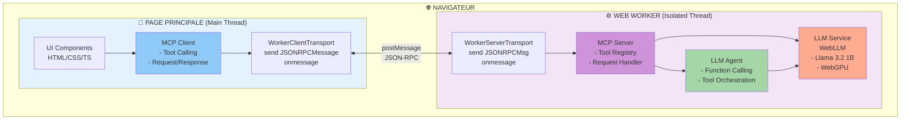
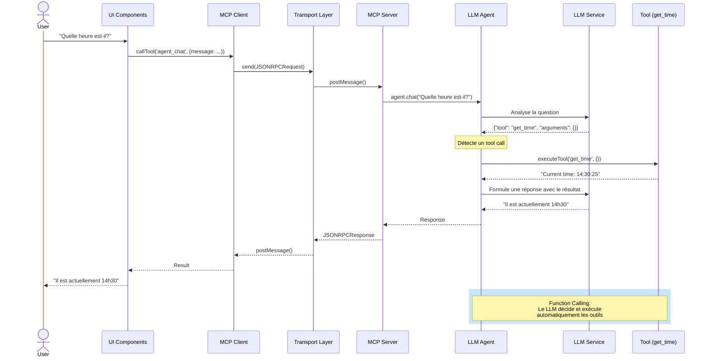

# MCP Browser POC - Serveur MCP dans le Navigateur

Ce projet démontre qu'il est **possible** de faire tourner un serveur MCP (Model Context Protocol) directement dans un navigateur web en utilisant un Web Worker.

## 🎯 Concept

L'architecture est la suivante :
- **Serveur MCP** : Tourne dans un Web Worker (processus isolé)
- **Client MCP** : Tourne dans la page principale
- **Transport** : Communication via `postMessage` au lieu de stdio/SSE traditionnel

## 🏗️ Architecture Détaillée



## 🔄 Flux d'une Requête Agent



## 📍 Prérequis

**Node.js** : Compatible avec Node 14.18+ (actuellement configuré pour Node 14.20.8)

**⚠️ Note importante** :
- ✅ **Node 14.x** : Fonctionne parfaitement avec **Gemini API** (provider recommandé)
- ⚠️ **Node 14.x** : WebLLM peut avoir des problèmes de function calling
- ✅ **Node 18+** : Tous les providers fonctionnent complètement

**Recommandation** : Utilisez **Gemini comme provider par défaut** avec Node 14, ou mettez à jour vers Node 18+ si vous souhaitez utiliser WebLLM.

```bash
# Pour mettre à jour vers Node 18+ (optionnel)
# Avec nvm (recommandé)
nvm install 18
nvm use 18
```

## 🚀 Installation

```bash
npm install
```

## ⚙️ Configuration

Le projet supporte la configuration via variables d'environnement pour sécuriser vos clés API.

### 1. Créer le fichier `.env`

```bash
cp .env.example .env
```

### 2. Configurer vos clés API

Éditez `.env` et remplissez vos informations :

```env
# Gemini Configuration
VITE_GEMINI_API_KEY=votre_clé_api_gemini_ici
VITE_GEMINI_MODEL=gemini-pro

# WebLLM Configuration (optionnel)
VITE_WEBLLM_MODEL=Llama-3.2-1B-Instruct-q4f32_1-MLC

# Provider par défaut
VITE_DEFAULT_PROVIDER=gemini
```

### 🔒 Sécurité des Clés API

Les clés API configurées dans `.env` sont :
1. **Cryptées au démarrage** : Utilise AES-GCM-256 avec Web Crypto API
2. **Stockées en mémoire** : Uniquement sous forme cryptée
3. **Décryptées à la demande** : Seulement quand nécessaire
4. **Liées à l'appareil** : Utilise un fingerprint du navigateur comme passphrase

⚠️ **Important** : 
- Le fichier `.env` est dans `.gitignore` (ne sera pas commité)
- N'exposez jamais vos clés API dans le code
- Pour la production, envisagez un backend proxy

## 💻 Développement

```bash
npm run dev
```

Ouvrez votre navigateur à l'adresse indiquée (généralement http://localhost:5173)

## 🏗️ Build

```bash
npm run build
npm run preview
```

## 🧪 Fonctionnalités du POC

Le serveur MCP implémente plusieurs outils de démonstration :

### 🤖 Outils LLM (Multi-Provider)
1. **llm_initialize** : Initialise un LLM provider (WebLLM ou Gemini)
2. **llm_chat** : Discute avec le LLM
3. **llm_status** : Vérifie le statut du LLM

**Providers supportés** :
- **WebLLM** : Llama 3.2 1B local (~1GB), fonctionne 100% dans le navigateur
- **Gemini** : Google Gemini API (nécessite une clé API)

### 🧠 Agent IA (Function Calling)
4. **agent_chat** : Agent intelligent qui peut utiliser les outils MCP automatiquement
5. **agent_reset** : Réinitialise l'historique de conversation de l'agent

### 🛠️ Outils Utilitaires
6. **get_time** : Retourne l'heure actuelle
7. **echo** : Répète un message
8. **calculate** : Effectue des calculs simples (add, subtract, multiply, divide)

### 📊 Outils ECharts (Visualisation) ✨ NOUVEAU

#### Découverte Hiérarchique (Token-Efficient)
9. **get_chart_types** : Liste tous les types de graphiques disponibles (line, bar, pie, scatter, radar, gauge, funnel, heatmap)
10. **get_chart_config_schema** : Obtient le schéma détaillé pour un type de graphique spécifique

#### Génération de Graphiques
11. **generate_line_chart** : Génère une configuration pour un graphique en ligne
12. **generate_bar_chart** : Génère une configuration pour un graphique en barres
13. **generate_pie_chart** : Génère une configuration pour un graphique circulaire (support des couleurs personnalisées)

**Génération par IA** 🎨 :
- **Décrivez votre graphique en langage naturel** et l'IA le génère automatiquement !
- Exemple : "Crée un graphique en ligne montrant les ventes de janvier à juin : 120, 200, 150, 180, 220, 250"
- L'agent utilise la découverte hiérarchique (33-56% moins de tokens) :
  - **Quick Path** : Si le type est connu → génération directe
  - **Discovery Path** : get_chart_types → get_chart_config_schema → generate
- Rendu direct dans le navigateur avec echarts@6.0

**Fonctionnalités** :
- Interface interactive avec prompt texte pour génération IA
- Boutons d'exemple pour démarrage rapide
- Détection automatique de demandes hors-sujet avec réponses humoristiques
- Visualisation immédiate du graphique
- Vue de la configuration JSON générée
- Support des couleurs personnalisées pour les pie charts

📖 **Guides détaillés** : 
- [AI_CHART_GENERATION.md](./AI_CHART_GENERATION.md) - Guide d'utilisation
- [HIERARCHY_DEMO.md](./HIERARCHY_DEMO.md) - Système de découverte hiérarchique

### 📊 Logging et Débogage

Le système inclut un logging détaillé pour suivre les interactions entre le LLM agent et les outils MCP :

**Console du navigateur (F12)** :
```
[Agent] 💬 Starting new chat: { message: "Quelle heure est-il?", availableTools: [...] }
[Agent] 🔧 LLM decided to use a tool: { tool: "get_time", arguments: {}, iteration: 1 }
[MCP Server] Received tool call: { tool: "get_time", arguments: {}, timestamp: "..." }
[Agent] ✅ Tool execution completed: { tool: "get_time", resultPreview: "..." }
```

**Points de logging** :
- 💬 Démarrage d'une conversation avec la liste des outils disponibles
- 🔧 Décision du LLM d'utiliser un outil (nom, arguments, itération)
- 📥 Réception de la requête côté serveur MCP
- ✅ Résultat de l'exécution de l'outil
- 🔄 Flux complet du function calling sur plusieurs itérations

## 📁 Structure du Projet

```
src/
├── transport.ts              # Implémentation du transport Web Worker
├── worker.ts                 # Serveur MCP dans le Worker (132 lignes, refactorisé)
├── client.ts                 # Client MCP pour la page principale
├── main.ts                   # Application principale (28 lignes, refactorisé)
├── llm-service.ts            # Service de gestion des LLM providers
├── llm-agent.ts              # Agent IA avec function calling
├── crypto-service.ts         # Chiffrement AES-GCM pour les clés API
├── config-manager.ts         # Gestion de la configuration
├── ui/                       # 🆕 Modules UI (refactorisation)
│   ├── logger.ts             # Classe Logger pour les messages UI
│   ├── html-template.ts      # Template HTML séparé de la logique
│   ├── event-handlers.ts     # Tous les gestionnaires d'événements
│   └── style.css             # Styles de l'interface utilisateur
├── charts/                   # 🆕 Module de gestion des graphiques
│   └── chart-handler.ts      # Logique de génération et rendu ECharts
├── providers/
│   ├── llm-provider.interface.ts
│   ├── webllm-provider.ts
│   └── gemini-provider.ts
└── mcp/                      # 🆕 Serveurs MCP modulaires
    ├── index.ts              # Export central de tous les serveurs
    ├── README.md             # Documentation de l'architecture MCP
    ├── basic-tools/          # Outils utilitaires (time, echo, calculate)
    │   ├── basic-tools-server.ts
    │   └── README.md
    ├── llm/                  # Outils LLM (initialize, status, chat)
    │   ├── llm-server.ts
    │   └── README.md
    ├── agent/                # Agent IA avec function calling
    │   ├── agent-server.ts
    │   └── README.md
    ├── echart/               # Serveur ECharts
    │   ├── echart-tools.ts   # Outils pour intégration browser
    │   ├── echart-server.ts  # Serveur standalone
    │   ├── test-server.ts
    │   ├── README.md
    │   └── STANDALONE.md
    └── chart-discovery/      # Documentation hiérarchie découverte
        └── README.md
```

### 🎯 Architecture Refactorisée

Le projet a été entièrement refactorisé pour une meilleure maintenabilité :

- **main.ts** : 821 lignes → **28 lignes** (97% de réduction)
- **worker.ts** : 843 lignes → **132 lignes** (84% de réduction)
- **Code modulaire** : Chaque serveur MCP dans son propre dossier
- **Documentation complète** : README dans chaque module

📖 Voir [REFACTORING.md](./REFACTORING.md) pour les détails de la refactorisation

## 🔑 Points Clés de l'Implémentation

### Transport Personnalisé

Le fichier `transport.ts` implémente l'interface `Transport` du SDK MCP pour utiliser `postMessage` :

- `WorkerServerTransport` : Côté serveur (dans le Worker)
- `WorkerClientTransport` : Côté client (page principale)

### Architecture Modulaire MCP

Le projet utilise une architecture modulaire pour organiser les serveurs MCP :

```typescript
// Chaque module expose son schéma et son handler
export function getToolsSchema() { return [...]; }
export function handleTool(name, args, deps) {
  // Retourne null si tool non reconnu
  if (name === 'my_tool') return result;
  return null;
}
```

**Avantages** :
- ✅ **Séparation des responsabilités** : Chaque serveur dans son module
- ✅ **Réutilisabilité** : Modules exportables et testables indépendamment
- ✅ **Maintenabilité** : Code organisé, facile à naviguer et modifier
- ✅ **Extensibilité** : Ajout de nouveaux serveurs sans toucher aux existants

**Organisation** :
- `src/mcp/basic-tools/` : Outils utilitaires (time, echo, calculate)
- `src/mcp/llm/` : Gestion des providers LLM
- `src/mcp/agent/` : Agent IA avec function calling
- `src/mcp/echart/` : Génération de graphiques ECharts
- `src/mcp/index.ts` : Export central de tous les modules

### Serveur MCP

Le `worker.ts` orchestre tous les handlers de manière élégante :

```typescript
async function handleToolCall(request) {
  // Essaie chaque handler dans l'ordre
  const basicResult = handleBasicTool(name, args);
  if (basicResult) return basicResult;

  const llmResult = await handleLLMTool(name, args, llmService);
  if (llmResult) return llmResult;

  const agentResult = await handleAgentTool(name, args, agent, tools);
  if (agentResult) return agentResult;
  
  // etc...
  
  throw new Error(`Unknown tool: ${name}`);
}
```

### Client MCP

Le `client.ts` encapsule la logique de connexion au Worker et l'appel des outils.

### Interface Utilisateur

L'UI est maintenant organisée en modules distincts :
- `ui/logger.ts` : Logging des messages UI avec horodatage
- `ui/html-template.ts` : Template HTML séparé de la logique
- `ui/event-handlers.ts` : Gestionnaires d'événements organisés par catégorie
- `charts/chart-handler.ts` : Logique de génération et rendu de graphiques

## ✅ Résultat

Ce POC démontre que :
- ✅ Un serveur MCP peut tourner dans un Web Worker
- ✅ La communication MCP fonctionne via postMessage
- ✅ Le client peut lister et appeler des outils
- ✅ L'architecture MCP est respectée
- ✅ **Un LLM local peut tourner dans le Worker et être exposé via MCP**
- ✅ WebLLM (Llama 3.2 1B) fonctionne entièrement dans le navigateur
- ✅ **Function calling automatique** : l'agent LLM peut orchestrer plusieurs outils MCP
- ✅ **Multi-provider** : Support de WebLLM (local) et Gemini API avec architecture extensible
- ✅ **Sécurité** : Clés API cryptées avec AES-GCM-256
- ✅ **Observabilité** : Logging détaillé pour déboguer le function calling
- ✅ **Architecture modulaire** : Serveurs MCP organisés en modules réutilisables
- ✅ **Token-efficient** : Découverte hiérarchique des outils (33-56% d'économie)
- ✅ **Maintenabilité** : Code refactorisé avec réduction de 84-97% de lignes dans les fichiers principaux

## 🚧 Limitations

- Pas d'accès au filesystem natif
- Capacités limitées au contexte navigateur
- Performance potentiellement inférieure à un serveur Node.js natif

## 🔮 Cas d'Usage Potentiels

- Extensions de navigateur avec capacités MCP
- Applications web avec agents IA locaux
- Playgrounds/demos MCP
- Tests MCP sans backend
- **Assistants IA 100% locaux et privés (pas de serveur externe)**
- **Applications offline-first avec IA intégrée**
- **Dashboards intelligents avec génération de graphiques par IA**
- **Outils d'analyse de données interactifs**
- **Serveurs MCP réutilisables** (chaque module peut être extrait et utilisé standalone)

## 🔑 Configuration des LLM Providers

### Gemini (API) ⭐ **Recommandé**
- **Prérequis** : Clé API Google (gratuite sur https://makersuite.google.com/app/apikey)
- **Configuration** : Dans `.env` (variable `VITE_GEMINI_API_KEY`)
- **Avantages** : Rapide, puissant, pas de téléchargement, **fonctionne parfaitement avec Node 14**
- **Inconvénients** : Nécessite Internet, quotas API
- **Statut** : ✅ **Pleinement opérationnel avec function calling**

### WebLLM (Local) ⚠️ **Expérimental avec Node 14**
- **Prérequis** : WebGPU (Chrome 113+, Edge, ou Firefox avec flag)
- **Premier lancement** : Télécharge ~1GB (mis en cache ensuite)
- **Configuration** : Optionnelle dans `.env` (variable `VITE_WEBLLM_MODEL`)
- **Avantages** : 100% local, privé, gratuit
- **Inconvénients** : Nécessite WebGPU, plus lent, **problèmes de function calling avec Node 14**
- **Statut** : ⚠️ Fonctionne mieux avec Node 18+ (recommandé uniquement pour tests)

### Obtenir une clé API Gemini

1. Visitez https://makersuite.google.com/app/apikey
2. Connectez-vous avec votre compte Google
3. Créez une nouvelle clé API
4. Copiez la clé dans `.env` → `VITE_GEMINI_API_KEY`

## 🎨 Architecture Agnostique

Le système utilise une architecture de **Provider Pattern** :
```typescript
interface LLMProvider {
  initialize(config): Promise<void>;
  chat(messages): Promise<Response>;
  getStatus(): Status;
}
```

### Gestion Sécurisée des Configurations

```
┌────────────────────────────────────────────────────┐
│              Démarrage Application                  │
└────────────────┬───────────────────────────────────┘
                 │
                 ▼
┌────────────────────────────────────────────────────┐
│     ConfigManager.initialize()                     │
│  1. Charge variables d'environnement (.env)        │
│  2. Génère passphrase device-specific             │
│  3. Crypte les clés API (AES-GCM-256)             │
│  4. Stocke en mémoire (forme cryptée)             │
└────────────────┬───────────────────────────────────┘
                 │
                 ▼
┌────────────────────────────────────────────────────┐
│     Utilisation Runtime                            │
│  - getConfig(): Décrypte à la demande             │
│  - setGeminiApiKey(): Crypte nouvelle clé         │
│  - Clés jamais en clair dans le code              │
└────────────────────────────────────────────────────┘
```

Facile d'ajouter d'autres providers (OpenAI, Anthropic, Mistral, etc.) sans modifier le reste du code !
