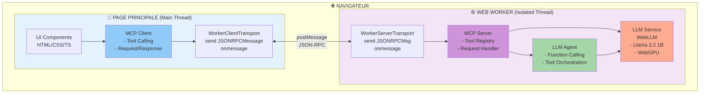
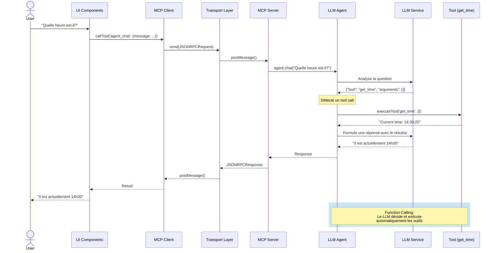

# MCP Browser POC - Serveur MCP dans le Navigateur

Ce projet démontre qu'il est **possible** de faire tourner un serveur MCP (Model Context Protocol) directement dans un navigateur web en utilisant un Web Worker.

## 🎯 Concept

L'architecture est la suivante :
- **Serveur MCP** : Tourne dans un Web Worker (processus isolé)
- **Client MCP** : Tourne dans la page principale
- **Transport** : Communication via `postMessage` au lieu de stdio/SSE traditionnel

## 🏗️ Architecture Détaillée



## 🔄 Flux d'une Requête Agent



## 📋 Prérequis

**Important** : Node.js >= 18.0.0 est requis (actuellement vous utilisez Node 14.20.0)

Pour mettre à jour Node.js, vous pouvez utiliser :
```bash
# Avec nvm (recommandé)
nvm install 18
nvm use 18

# Ou avec n
npm install -g n
n stable
```

## 🚀 Installation

```bash
npm install
```

## 💻 Développement

```bash
npm run dev
```

Ouvrez votre navigateur à l'adresse indiquée (généralement http://localhost:5173)

## 🏗️ Build

```bash
npm run build
npm run preview
```

## 🧪 Fonctionnalités du POC

Le serveur MCP implémente plusieurs outils de démonstration :

### 🤖 Outils LLM (WebLLM)
1. **llm_initialize** : Initialise un LLM local (Llama 3.2 1B, ~1GB)
2. **llm_chat** : Discute avec le LLM local
3. **llm_status** : Vérifie le statut du LLM

### 🧠 Agent IA (Function Calling)
4. **agent_chat** : Agent intelligent qui peut utiliser les outils MCP automatiquement
5. **agent_reset** : Réinitialise l'historique de conversation de l'agent

### 🛠️ Outils Utilitaires
6. **get_time** : Retourne l'heure actuelle
7. **echo** : Répète un message
8. **calculate** : Effectue des calculs simples (add, subtract, multiply, divide)

## 📁 Structure du Projet

```
src/
├── transport.ts      # Implémentation du transport Web Worker
├── worker.ts         # Serveur MCP dans le Worker
├── client.ts         # Client MCP pour la page principale
├── main.ts           # Application principale
└── style.css         # Styles
```

## 🔑 Points Clés de l'Implémentation

### Transport Personnalisé

Le fichier `transport.ts` implémente l'interface `Transport` du SDK MCP pour utiliser `postMessage` :

- `WorkerServerTransport` : Côté serveur (dans le Worker)
- `WorkerClientTransport` : Côté client (page principale)

### Serveur MCP

Le `worker.ts` crée un serveur MCP standard avec nos outils personnalisés.

### Client MCP

Le `client.ts` encapsule la logique de connexion au Worker et l'appel des outils.

## ✅ Résultat

Ce POC démontre que :
- ✅ Un serveur MCP peut tourner dans un Web Worker
- ✅ La communication MCP fonctionne via postMessage
- ✅ Le client peut lister et appeler des outils
- ✅ L'architecture MCP est respectée
- ✅ **Un LLM local peut tourner dans le Worker et être exposé via MCP**
- ✅ WebLLM (Llama 3.2 1B) fonctionne entièrement dans le navigateur

## 🚧 Limitations

- Pas d'accès au filesystem natif
- Capacités limitées au contexte navigateur
- Performance potentiellement inférieure à un serveur Node.js natif

## 🔮 Cas d'Usage Potentiels

- Extensions de navigateur avec capacités MCP
- Applications web avec agents IA locaux
- Playgrounds/demos MCP
- Tests MCP sans backend
- **Assistants IA 100% locaux et privés (pas de serveur externe)**
- **Applications offline-first avec IA intégrée**

## ⚠️ Note sur WebLLM

Au premier lancement, WebLLM téléchargera le modèle Llama 3.2 1B (~1GB). Le modèle est mis en cache dans le navigateur pour les utilisations futures. WebGPU est requis (Chrome/Edge récent ou Firefox avec flag activé).
