# MCP Browser POC - Serveur MCP dans le Navigateur

Ce projet démontre qu'il est **possible** de faire tourner un serveur MCP (Model Context Protocol) directement dans un navigateur web en utilisant un Web Worker.

## 🎯 Concept

L'architecture est la suivante :
- **Serveur MCP** : Tourne dans un Web Worker (processus isolé)
- **Client MCP** : Tourne dans la page principale
- **Transport** : Communication via `postMessage` au lieu de stdio/SSE traditionnel

## 🏗️ Architecture Détaillée


## 🔄 Flux d'une Requête Agent

```mermaid
sequenceDiagram
    actor User
    participant UI as UI Components
    participant Client as MCP Client
    participant Transport as Transport Layer
    participant Server as MCP Server
    participant Agent as LLM Agent
    participant LLM as LLM Service
    participant Tool as Tool (get_time)
    
    User->>UI: "Quelle heure est-il?"
    UI->>Client: callTool('agent_chat', {message: ...})
    Client->>Transport: send(JSONRPCRequest)
    Transport->>Server: postMessage()
    Server->>Agent: agent.chat("Quelle heure est-il?")
    
    Agent->>LLM: Analyse la question
    LLM-->>Agent: {"tool": "get_time", "arguments": {}}
    Note over Agent: Détecte un tool call
    
    Agent->>Tool: executeTool('get_time', {})
    Tool-->>Agent: "Current time: 14:30:25"
    
    Agent->>LLM: Formule une réponse avec le résultat
    LLM-->>Agent: "Il est actuellement 14h30"
    
    Agent-->>Server: Response
    Server-->>Transport: JSONRPCResponse
    Transport-->>Client: postMessage()
    Client-->>UI: Result
    UI-->>User: "Il est actuellement 14h30"
    
    rect rgb(200, 230, 255)
        Note over Agent,Tool: Function Calling:<br/>Le LLM décide et exécute<br/>automatiquement les outils
    end
```



## 📋 Prérequis

**Important** : Node.js >= 18.0.0 est requis (actuellement vous utilisez Node 14.20.0)

Pour mettre à jour Node.js, vous pouvez utiliser :
```bash
# Avec nvm (recommandé)
nvm install 18
nvm use 18

# Ou avec n
npm install -g n
n stable
```

## 🚀 Installation

```bash
npm install
```

## ⚙️ Configuration

Le projet supporte la configuration via variables d'environnement pour sécuriser vos clés API.

### 1. Créer le fichier `.env`

```bash
cp .env.example .env
```

### 2. Configurer vos clés API

Éditez `.env` et remplissez vos informations :

```env
# Gemini Configuration
VITE_GEMINI_API_KEY=votre_clé_api_gemini_ici
VITE_GEMINI_MODEL=gemini-1.5-flash

# WebLLM Configuration (optionnel)
VITE_WEBLLM_MODEL=Llama-3.2-1B-Instruct-q4f32_1-MLC

# Provider par défaut
VITE_DEFAULT_PROVIDER=gemini
```

### 🔒 Sécurité des Clés API

Les clés API configurées dans `.env` sont :
1. **Cryptées au démarrage** : Utilise AES-GCM-256 avec Web Crypto API
2. **Stockées en mémoire** : Uniquement sous forme cryptée
3. **Décryptées à la demande** : Seulement quand nécessaire
4. **Liées à l'appareil** : Utilise un fingerprint du navigateur comme passphrase

⚠️ **Important** : 
- Le fichier `.env` est dans `.gitignore` (ne sera pas commité)
- N'exposez jamais vos clés API dans le code
- Pour la production, envisagez un backend proxy

## 💻 Développement

```bash
npm run dev
```

Ouvrez votre navigateur à l'adresse indiquée (généralement http://localhost:5173)

## 🏗️ Build

```bash
npm run build
npm run preview
```

## 🧪 Fonctionnalités du POC

Le serveur MCP implémente plusieurs outils de démonstration :

### 🤖 Outils LLM (Multi-Provider)
1. **llm_initialize** : Initialise un LLM provider (WebLLM ou Gemini)
2. **llm_chat** : Discute avec le LLM
3. **llm_status** : Vérifie le statut du LLM

**Providers supportés** :
- **WebLLM** : Llama 3.2 1B local (~1GB), fonctionne 100% dans le navigateur
- **Gemini** : Google Gemini API (nécessite une clé API)

### 🧠 Agent IA (Function Calling)
4. **agent_chat** : Agent intelligent qui peut utiliser les outils MCP automatiquement
5. **agent_reset** : Réinitialise l'historique de conversation de l'agent

### 🛠️ Outils Utilitaires
6. **get_time** : Retourne l'heure actuelle
7. **echo** : Répète un message
8. **calculate** : Effectue des calculs simples (add, subtract, multiply, divide)

### 📊 Logging et Débogage

Le système inclut un logging détaillé pour suivre les interactions entre le LLM agent et les outils MCP :

**Console du navigateur (F12)** :
```
[Agent] 💬 Starting new chat: { message: "Quelle heure est-il?", availableTools: [...] }
[Agent] 🔧 LLM decided to use a tool: { tool: "get_time", arguments: {}, iteration: 1 }
[MCP Server] Received tool call: { tool: "get_time", arguments: {}, timestamp: "..." }
[Agent] ✅ Tool execution completed: { tool: "get_time", resultPreview: "..." }
```

**Points de logging** :
- 💬 Démarrage d'une conversation avec la liste des outils disponibles
- 🔧 Décision du LLM d'utiliser un outil (nom, arguments, itération)
- 📥 Réception de la requête côté serveur MCP
- ✅ Résultat de l'exécution de l'outil
- 🔄 Flux complet du function calling sur plusieurs itérations

## 📁 Structure du Projet

```
src/
├── transport.ts      # Implémentation du transport Web Worker
├── worker.ts         # Serveur MCP dans le Worker
├── client.ts         # Client MCP pour la page principale
├── main.ts           # Application principale
└── style.css         # Styles
```

## 🔑 Points Clés de l'Implémentation

### Transport Personnalisé

Le fichier `transport.ts` implémente l'interface `Transport` du SDK MCP pour utiliser `postMessage` :

- `WorkerServerTransport` : Côté serveur (dans le Worker)
- `WorkerClientTransport` : Côté client (page principale)

### Serveur MCP

Le `worker.ts` crée un serveur MCP standard avec nos outils personnalisés.

### Client MCP

Le `client.ts` encapsule la logique de connexion au Worker et l'appel des outils.

## ✅ Résultat

Ce POC démontre que :
- ✅ Un serveur MCP peut tourner dans un Web Worker
- ✅ La communication MCP fonctionne via postMessage
- ✅ Le client peut lister et appeler des outils
- ✅ L'architecture MCP est respectée
- ✅ **Un LLM local peut tourner dans le Worker et être exposé via MCP**
- ✅ WebLLM (Llama 3.2 1B) fonctionne entièrement dans le navigateur
- ✅ **Function calling automatique** : l'agent LLM peut orchestrer plusieurs outils MCP
- ✅ **Multi-provider** : Support de WebLLM (local) et Gemini API avec architecture extensible
- ✅ **Sécurité** : Clés API cryptées avec AES-GCM-256
- ✅ **Observabilité** : Logging détaillé pour déboguer le function calling

## 🚧 Limitations

- Pas d'accès au filesystem natif
- Capacités limitées au contexte navigateur
- Performance potentiellement inférieure à un serveur Node.js natif

## 🔮 Cas d'Usage Potentiels

- Extensions de navigateur avec capacités MCP
- Applications web avec agents IA locaux
- Playgrounds/demos MCP
- Tests MCP sans backend
- **Assistants IA 100% locaux et privés (pas de serveur externe)**
- **Applications offline-first avec IA intégrée**

## 🔑 Configuration des LLM Providers

### WebLLM (Local)
- **Prérequis** : WebGPU (Chrome 113+, Edge, ou Firefox avec flag)
- **Premier lancement** : Télécharge ~1GB (mis en cache ensuite)
- **Configuration** : Optionnelle dans `.env` (variable `VITE_WEBLLM_MODEL`)
- **Avantages** : 100% local, privé, gratuit
- **Inconvénients** : Nécessite WebGPU, plus lent

### Gemini (API)
- **Prérequis** : Clé API Google (gratuite sur https://makersuite.google.com/app/apikey)
- **Configuration** : Dans `.env` (variable `VITE_GEMINI_API_KEY`)
- **Avantages** : Rapide, puissant, pas de téléchargement
- **Inconvénients** : Nécessite Internet, quotas API

### Obtenir une clé API Gemini

1. Visitez https://makersuite.google.com/app/apikey
2. Connectez-vous avec votre compte Google
3. Créez une nouvelle clé API
4. Copiez la clé dans `.env` → `VITE_GEMINI_API_KEY`

## 🎨 Architecture Agnostique

Le système utilise une architecture de **Provider Pattern** :
```typescript
interface LLMProvider {
  initialize(config): Promise<void>;
  chat(messages): Promise<Response>;
  getStatus(): Status;
}
```

### Gestion Sécurisée des Configurations

```
┌────────────────────────────────────────────────────┐
│              Démarrage Application                  │
└────────────────┬───────────────────────────────────┘
                 │
                 ▼
┌────────────────────────────────────────────────────┐
│     ConfigManager.initialize()                     │
│  1. Charge variables d'environnement (.env)        │
│  2. Génère passphrase device-specific             │
│  3. Crypte les clés API (AES-GCM-256)             │
│  4. Stocke en mémoire (forme cryptée)             │
└────────────────┬───────────────────────────────────┘
                 │
                 ▼
┌────────────────────────────────────────────────────┐
│     Utilisation Runtime                            │
│  - getConfig(): Décrypte à la demande             │
│  - setGeminiApiKey(): Crypte nouvelle clé         │
│  - Clés jamais en clair dans le code              │
└────────────────────────────────────────────────────┘
```

Facile d'ajouter d'autres providers (OpenAI, Anthropic, Mistral, etc.) sans modifier le reste du code !
